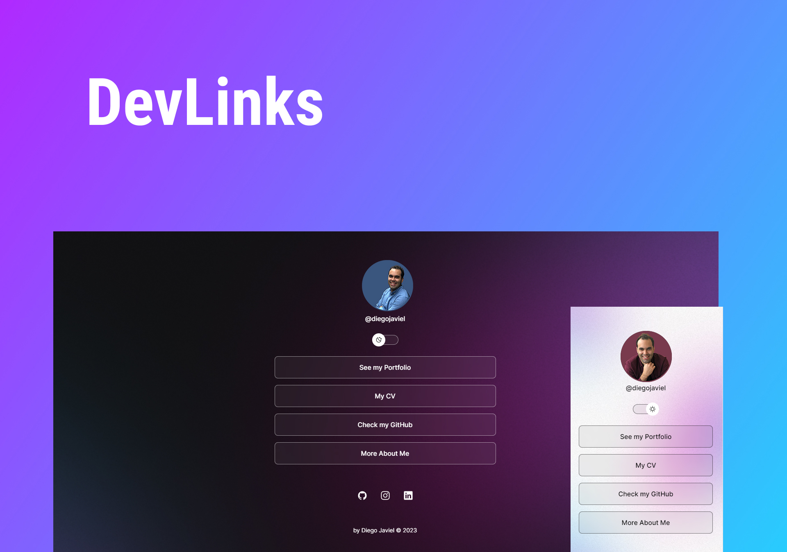

<h1 align="center"> DevLinks </h1>

  <a href="#-technologies">Technologies</a>&nbsp;&nbsp;&nbsp;|&nbsp;&nbsp;&nbsp;
  <a href="#-project">Project</a>&nbsp;&nbsp;&nbsp;|&nbsp;&nbsp;&nbsp;
  <a href="#-layout">Layout</a>&nbsp;&nbsp;&nbsp;|&nbsp;&nbsp;&nbsp;
  <a href="#memo-license">License</a>

  

 

  

## 🚀 Technologies

This project was developed with the following technologies:

- HTML e CSS
- JavaScript
- Git & Github
- Figma

## 💻 Project

DevLinks is a link aggregator for use as an online business card.

- [Access the project up & running](https://maykbrito.github.io/devlinks)

## 🔖 Layout

You can check the project's layout through [THIS LINK](https://www.figma.com/community/file/1187422022288947321). It will be necessary to have an account at [Figma](https://figma.com) in order to be able to seeing it.

## :memo: License

This project is under MIT License.

---
